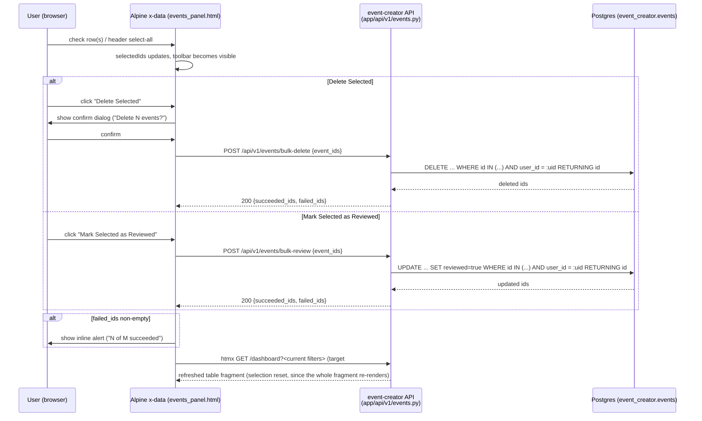

# Dashboard bulk actions — Technical Design

**Feature:** [`PRD.md`](PRD.md)
**Date:** 2026-07-27
**Status:** Draft

## Architecture at a Glance

- Two new endpoints on the *existing* `app/api/v1/events.py` router — no new module, no service/
  repository layer. Same file that already holds the single-event `DELETE`/`PATCH` handlers.
- Both are `POST /api/v1/events/bulk-delete` and `POST /api/v1/events/bulk-review`, each a single
  `RETURNING`-based bulk DML statement scoped by `WHERE id IN (...) AND user_id = :user_id` —
  the same ownership-scoping principle `get_owned_event` already establishes for single events,
  applied set-wise instead of row-wise, in one DB round trip.
- One shared request schema (`BulkEventIdsRequest`) and one shared response schema
  (`BulkActionResult`) for both endpoints, so a future third bulk endpoint has an established
  shape to reuse rather than inventing its own field names.
- No DB migration — `reviewed` already exists on `Event`.
- No proxy/registry change — `/api/v1/events` is already an `api_prefixes` entry, and both new
  paths are true sub-paths (`/api/v1/events/bulk-delete`, not `/api/v1/events-bulk-delete`), which
  is what the existing wildcard routing pattern requires.
- Frontend: bulk-selection state extends the existing Alpine `x-data` scope in
  `events_panel.html` (the same one already owning delete-confirm and reviewed-toggle state);
  both bulk actions re-fetch `#dashboard-body` via the existing HTMX swap pattern on completion,
  which also resets selection to empty for free.

## Design Decisions

### Where the new endpoints live

Both bulk endpoints are added to `app/api/v1/events.py`, next to `delete_event`/`update_event` —
not a new `events_bulk.py` module, and not behind a service/repository class. This repo has
exactly one file per concern for every existing feature (one router, one page module, one schema
module, one model), and routers call plain async query functions directly everywhere — there is no
service/repository layer anywhere in this codebase for any feature. Introducing one only for bulk
operations would create an unexplained asymmetry: single-event delete/update stay inline
(query → mutate → commit), while bulk delete/update alone get wrapped in a class, for no reason
other than "built later." See
[`docs/adr/dashboard-bulk-actions-no-service-layer.md`](../../adr/dashboard-bulk-actions-no-service-layer.md).

### Request/response schemas

```python
class BulkEventIdsRequest(BaseModel):
    """Body shared by both bulk endpoints - just the target IDs. extra="forbid" so a stray
    "reviewed" field (e.g. a future frontend bug trying to bulk-unreview) 422s loudly instead
    of silently no-op'ing - bulk-review is deliberately one-directional (always sets True) with
    no field to override that."""
    model_config = ConfigDict(extra="forbid")
    event_ids: list[uuid.UUID] = Field(..., min_length=1, max_length=PAGE_SIZE)


class BulkActionResult(BaseModel):
    """Response for both bulk endpoints. succeeded_ids is the full list (not just a count) since
    it costs nothing extra (already have it from RETURNING) and lets the frontend know exactly
    which rows changed. No separate "requested"/"total" field - len(succeeded_ids) +
    len(failed_ids) already equals the de-duplicated request count; a third field would just be
    a second source of truth that could drift."""
    succeeded_ids: list[uuid.UUID]
    failed_ids: list[uuid.UUID]
```

`max_length=PAGE_SIZE` (reusing the existing `PAGE_SIZE = 50` constant) enforces the "current page
only" selection scope server-side too, not just in the frontend — an oversized or crafted request
already represents invalid application state per the PRD, so it 422s rather than being trusted.
Requesting an empty list also 422s (`min_length=1`), both via Pydantic validation with no custom
code, consistent with how the rest of this router already lets FastAPI/Pydantic own 422s (the one
exception, `parse_date_param`, raises 422 manually specifically because it isn't Pydantic-native
validation).

A bulk request that matches nothing (every ID invalid or unowned) still returns `200` with
`succeeded_ids=[]`, `failed_ids=<everything>` — never a `404`. A `404` here would leak the same
information the single-event endpoints deliberately withhold: whether *any* of the submitted IDs
exist and belong to someone else. Status code alone must never distinguish "nothing matched" from
"partial match."

### HTTP method and path

`POST /api/v1/events/bulk-delete` and `POST /api/v1/events/bulk-review` — not `DELETE
/api/v1/events` with a body. See
[`docs/adr/dashboard-bulk-actions-bulk-delete-http-method.md`](../../adr/dashboard-bulk-actions-bulk-delete-http-method.md)
for the full trade-off.

Both paths are true sub-paths of `/api/v1/events` (a literal `/` after `events`), which matters for
routing: `/api/v1/events` is already listed in this service's `api_prefixes`
(`app/core/registry.py`), and the platform's path-rule generator
(`infra/path_rules.py`, shared verbatim by the GCP URL map and the local Caddyfile) emits both the
bare prefix and a `/*` wildcard for every `api_prefixes` entry — but the wildcard only matches
paths with a `/` after the prefix. A sibling path *without* the slash (e.g.
`/api/v1/events-bulk-delete`) would not match either pattern and would silently fall through to
the Host's default service. No registry or proxy config change is needed as long as both new paths
stay true sub-paths — confirm this explicitly as an acceptance check, not just an implementation
detail.

### Best-effort semantics, implemented as a single `RETURNING` statement

Per the PRD, both endpoints process on a best-effort basis (skip invalid/unowned IDs, report
which). Implemented as one bulk DML statement per endpoint, not a fetch-then-loop:

```python
requested_ids = list(dict.fromkeys(body.event_ids))  # de-dupe, preserve order

result = await db.execute(
    delete(Event)
    .where(Event.id.in_(requested_ids), Event.user_id == user_id)
    .returning(Event.id)
)
succeeded_ids = list(result.scalars().all())
await db.commit()
failed_ids = [i for i in requested_ids if i not in set(succeeded_ids)]
```

(`bulk-review` is identical in shape, using `update(Event).values(reviewed=True)` instead of
`delete(Event)`, and its `WHERE` is *not* additionally scoped to `Event.reviewed.is_(False)` —
an already-reviewed event submitted again still matches, gets re-set to `True` (a no-op at the
storage level), and comes back in `succeeded_ids`. This keeps bulk-review idempotent: resubmitting
a mixed reviewed/unreviewed selection never produces a surprising `failed_id` for a row that was
already in the target state.)

De-duplicating the incoming ID list before diffing matters for the "N of M" reporting to make
sense: without it, a submitted-twice ID that succeeds shows up once in `succeeded_ids` (a
`RETURNING` set is naturally deduped by row), and the arithmetic against the raw request would be
off by however many times an ID was repeated.

This resolves to the same *principle* `get_owned_event` already uses for single events (ownership
folded directly into the `WHERE`, so a mismatched ID is indistinguishable in the query from a
nonexistent one — "never confirm another user's event exists" falls out for free) — just
implemented as one set-based statement instead of a fetch-then-mutate loop, since a single
`RETURNING` round trip is strictly cheaper than fetching N rows via the ORM and deleting/updating
each individually, and neither endpoint needs any ORM-level cascade or instance event that a raw
bulk statement would bypass.

### Observability

Log one structured line per bulk action completion (actor `user_id`, action type, requested ID
count, `succeeded_ids`, `failed_ids`) rather than relying on whatever per-row logging the reused
query machinery happens to produce. A 50-item bulk delete is a materially higher-blast-radius
single action than 50 individual clicks with no undo/soft-delete in this PRD's scope, so one
greppable log line per bulk action is what makes "what did this user just do" answerable after the
fact. No new infra — Cloud Run's existing stdout → Cloud Logging capture already covers it.

### Frontend: extending the existing Alpine scope

Bulk-selection state (`selectedIds`, a `selectAll`/indeterminate computed value, `bulkDeleting`,
`openBulkConfirm()`, `confirmBulkDelete()`, `markSelectedReviewed()`) is added to the same `x-data`
object in `events_panel.html` that already owns `deleting`/`error`/`pendingId`/`openConfirm()`/
`confirmDelete()`/`toggleReviewed()` — not a new, separate scope. Two things follow from that:

- Bulk-action failures write into the *same* `error` field the existing delete/toggle handlers
  already use (not a new `bulkError`), so there is never more than one error banner on screen at
  once. Each handler already clears `error` at its own start; the two new bulk handlers must do the
  same.
- Because a bulk action's success path re-fetches `#dashboard-body` via HTMX (same pattern
  `toggleReviewed()` already uses), the entire fragment — including this `x-data` block — is
  replaced, which resets `selectedIds` to empty automatically. This is what the PRD's "selection
  clears after any bulk action" requirement means concretely: it isn't separate logic to write, it
  falls out of the existing re-fetch pattern. State this explicitly here so it isn't later mistaken
  for a bug ("why did my selection disappear?").

This flat `x-data` object is now coordinating three concerns (single-delete, single-toggle, bulk)
by convention rather than structure. That's fine at this size, but it's the ceiling: if a third
bulk action or another row-level action is added later, that's the point to split bulk-selection
into its own nested Alpine scope rather than continuing to flatten everything into one object.

Selection-plumbing (`selectedIds`, the header checkbox's indeterminate state, toolbar
visibility) is kept action-agnostic — it doesn't know about "delete" or "reviewed" specifically —
so a future third toolbar button can read `selectedIds` and add its own handler without touching
the selection mechanism itself.

## Component/Data Flow



## Testing Approach

**Primary seam — `e2e/tests/dashboard.spec.ts` (Playwright, existing file, per the PRD):** new
specs following the existing `'delete removes an event behind a confirm dialog'` test's structure
(register a user, upload the canned two-event fixture, interact with the table): row/select-all
checkbox behavior and toolbar visibility, bulk delete behind its confirm dialog, bulk mark-reviewed
with no confirm dialog, selection clearing on filter/sort change and after a bulk action.

**Secondary seam — `tests/test_events_api.py` (pytest + httpx, existing file):** new cases for
backend edge cases impractical to set up through a real browser (need multi-user fixtures, which
this file's existing tests already do via `tests/conftest.py`'s `TokenFactory`/
`create_host_user`):

- Auth required (401) for both endpoints, mirroring the existing single-event tests.
- 422 for an empty `event_ids` list and for a list over `PAGE_SIZE` (51 ids).
- 422 for a bulk-review request carrying an extra `reviewed` field (`extra="forbid"`) — proves
  bulk-unreview isn't reachable through this endpoint.
- A request mixing the caller's own IDs with another user's IDs (or a nonexistent ID) only affects
  the caller's own events, and reports the others in `failed_ids` — never a 403 and never a 404 for
  the request as a whole. **This is the assertion shape that's new relative to the existing
  single-event tests**: those only need to check a status code; bulk tests need to assert on
  `succeeded_ids`/`failed_ids` *contents* to prove the ownership-scoping guarantee holds when
  valid and invalid IDs are mixed in one request — that's the actual regression guard.
- Resubmitting the same ID twice in one request doesn't error and produces a de-duplicated
  `succeeded_ids`.
- Bulk-review on an already-reviewed event still counts as succeeded (idempotent), not failed.

A small `_make_events(db, user_id, run_id, count=2) -> list[Event]` helper is added alongside the
existing `_make_event` so bulk tests don't hand-roll a loop per test.

No new fixture infrastructure is needed beyond that — `client`, `db`/`db_session`, and the
token/user factories all carry over unchanged, since both bulk endpoints reuse the exact same
auth/session dependencies (`current_user_id`, `get_db`) as the single-event endpoints.

## Open Questions

- Exact wording for the bulk-delete confirmation dialog and the partial-failure alert banner text
  (e.g. "Delete 5 events? This cannot be undone." / "4 of 5 events deleted.") — copy-level detail,
  fine to settle during implementation rather than blocking `/to-wbs`.
- Whether the audit log line described above should also be written anywhere queryable beyond
  Cloud Logging (e.g. a dedicated audit table) — out of scope per the PRD unless the user wants it
  pulled in; flagging so it isn't silently dropped.
